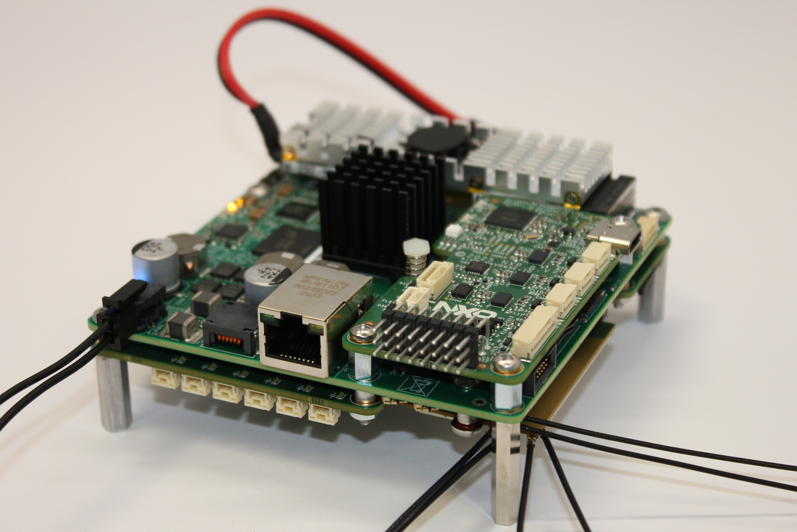
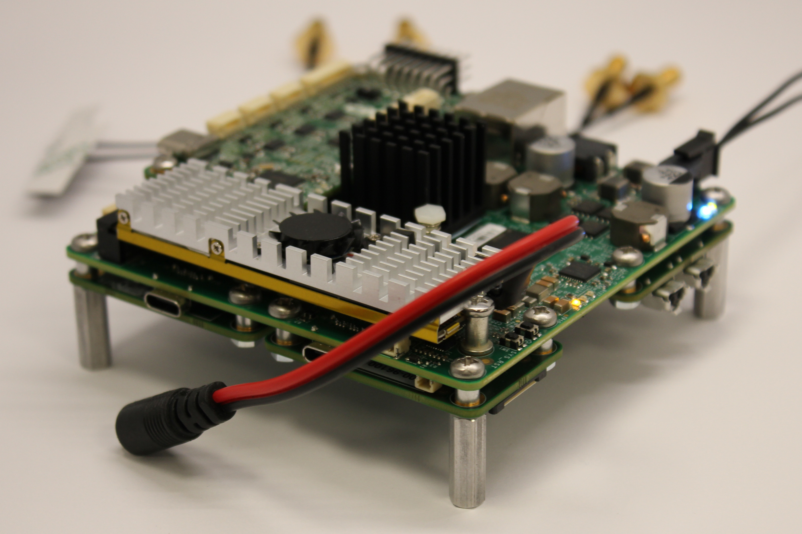

# NXP NavQ95 Vehicle Computer

Welcome to the documentation for the NavQ95, a vehicle computer reference design designed around the NXP i.MX95 developed by NXP Mobile Robotics. Please note that this board is currently a Proof of Concept only and is considered not supported by NXP.

The NavQ95 features a single main board with a small form factor and is designed to merge a Vehicle Management Unit and a Vehicle Companion Computer into one unified, heterogeneous MCU/MPU device.

> [!TIP]
> See [MR-NAVQ95/Mr Solutions MR-MR-NAVQ95-RevB description slides (Public).pdf](<https://github.com/NXP-Robotics/MR-NAVQ95/blob/main/Mr Solutions MR-NavQ95-RevB description slides (Public).pdf>) also for a short overview presentation.

MR-NavQ95 Switch view     |  MR-NavQ95 ARA-2 View
:-------------------------:|:-------------------------:
  |  

# Core Architecture & AI

The heterogeneous vehicle computer is powered by the [NXP i.MX 95](https://www.nxp.com/products/i.MX95) processor and is divided into specific execution domains:
- **Compute**: 6x Arm Cortex-A55 cores dedicated to executing compute-intense functions.
- **Real-Time Control**: 1x Arm Cortex-M7 core to execute real-time control tasks.
- **System Management**: 1x Arm Cortex-M33 core to execute the NXP System Manager.

## AI Capabilities:

- Equipped with an on-chip NXP Neutron NPU.
- High-bandwidth M.2 PCIe interfaces target up to 2 [NXP Kinara ARA-2 NPUs](https://www.nxp.com/products/ARA240).
- Supports cloud-based AI via Wifi6 or 5G connectivity

## Software Stack:

The board is designed to run open-source software, leveraging its multi-core architecture:

- A55 Cores: Runs the Ubuntu PoC image 24.04 with ROS2 Jazzy.
> [!NOTE]
> Please note: This is an open Proof of Concept (POC) deisign and is not officially supported by NXP.
> The design is enabled with a Vanilla UbuntuPOC layered on top of existing NXP Yocto build.
> This means ROS2 main installs via `apt install ros2`.
>
>The unsupported software repo may be found here:
https://github.com/NXP-Robotics/imx-manifest-navq95-private
- M7 Core: Runs either Zephyr / Cognipilot or Nuttx / PX4.
- Communication: High-speed inter-core communication is facilitated using shared memory / OpenAMP RpMsg.

## Hardware Specifications

### Power and Memory
* **Input Power:** Supports a voltage range of 9V to 52V, which easily accommodates up to 12S battery configurations.
* **RAM:** Up to 16 GB of LPDDR5 memory.
* **Storage Options:** 64 GB onboard eMMC, an Octal-SPI Flash module, a Micro SD card reader, and PCIe M.2 support for solid-state drives.

### Connectivity
* **Standard Ethernet:** One Gigabit RJ45 port supporting Precision Time Protocol (PTP).
* **Automotive Ethernet:** Both 100BASE-T1 and 1000BAS-T1 ports, also featuring PTP.
> [!TIP]
> 100(0)BASE-T1 is Ethernet over single unshielded twisted pair
* **Wireless Comms:** Powered by the NXP IW612 chip for Wi-Fi, Bluetooth, and Matter support.
* **Cellular Data:** Includes a SIM slot and an M.2 PCIe interface meant for a cellular modem.

### Onboard Mobile Robotics Sensors
* Inertial Measurement Unit (IMU)
* Magnetometer
* Barometer

### Physical Interfaces
* USB 2.0 and 3.0 ports.
* Two PCIe M.2 slots (Type M and Type B).
* A 10-pin JTAG SWD debugging header.

---

## Expansion Capabilities

The system is highly adaptable thanks to support for modular add-on boards:

**Networking Add-ons:** 
* [MR-NAVQ95E-T1S](Schematic-Rev-B/SPF-96101_B-T1SWITCH.pdf): T1 Switch, utilizing the NXP SJA1110 for six 100BASE-T1 connections and 2x 1000BASE-T1.
* [MR-NAVQ95E-T1P](Schematic-Rev-A/SPF-96098_A-T1PHY.pdf): T1 Single Phy setup using the NXP TJA1103.

**Vision / Camera:** 
* [MR-NAVQ95E-CAM](Schematic-Rev-B/SPF-96100_B-CAM.pdf): A 22-pin Raspberry Pi-style connector expansion board for CSI/DSI interfaces.

**General purpose I/O**
* [MR-NAVQ95E-IO](Schematic-Rev-B/SPF-96099_B-IO.pdf): Drone & Rover IO:** Uses standard DroneCode connectors for extensive peripheral support:
    * 3x CAN-FD
    * Bosch BMI088 IMU
    * 8x FlexIO/PWM output
    * DroneCode JST-GH 10-pin GPS connector
    * DroneCode JST-GH 6-pin Telemetry connector
    * DroneCode JST-GH 4-pin I2C connector
    * WM8962B Audio codec with:
        * Audio jack
        * 2x PDM Microphones
        * 2x 1W stereo output
    * 2x UART to USB-C for Serial Console

## M-core realtime software
A range of software platforms can be deployed on the Cortex-M core. The following software platforms have been prepared for use with the MR‑NAVQ95:
- Zephyr
  - https://www.zephyrproject.org/
- Cognipilot Cerebri (Zephyr based)
  - https://cognipilot.org/
- NuttX
  - https://nuttx.apache.org/
  - https://nuttx.apache.org/docs/latest/platforms/arm/imx9/boards/mr-navq95b/index.html
- PX4 Autopilot (NuttX based)
  - https://px4.io/

Note: NXP and the NXP logo are registered trademarks of NXP B.V.
